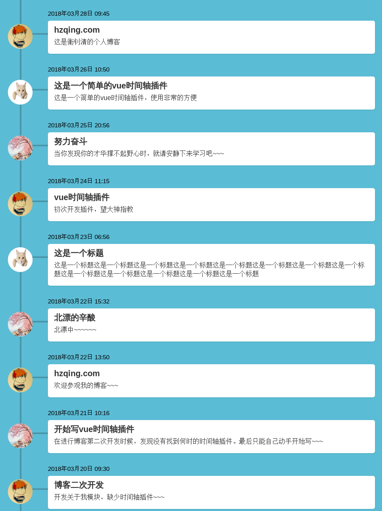

# hzqing-vue-timeline

> A Vue component to hzqing-vue-timeline 一个Vue的时间插件

## example (图片展示)


### 屏幕宽度大于1200px


### 屏幕宽度小于1200px



## 安装

```JS
npm install -S hzqing-vue-timeline
```

## 使用

```js
// ES6
import hzqingVueTimeLine from 'hzqing-vue-timeline.js'
// require
var hzqingVueTimeLine = require('hzqingTimeLine')

Vue.use(hzqingVueTimeLine)

// 或者直接使用script导入
<script src="./node_modules/vue/dist/hzqing-vue-timeline.js"></script>

// 作为组件的方式使用
 <hzqing-vue-timeline></hzqing-vue-timeline>
```

### 配置

```html
   <hzqing-vue-timeline 
   timelineColor="#5bbcd5"  
   timeContentColor="#fff"
   ></hzqing-vue-timeline>
```

### Props

|    name    |    Description   |   type   |default|
| -----------------  | ---------------- | :--------: | :----------: |
| timelineColor       | 时间轴插件整个背景颜色 |String| #5bbcd5
| timeContentColor        | 文字内容背景颜色 |String | #f2f2f2


